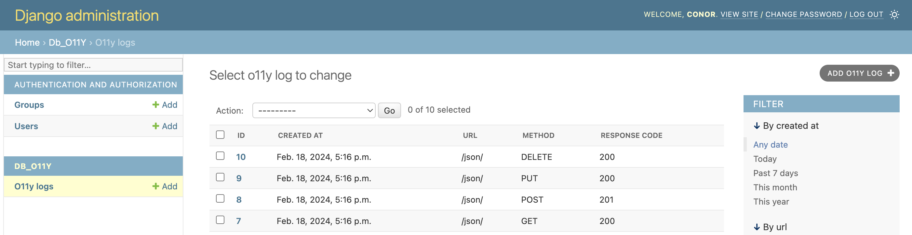
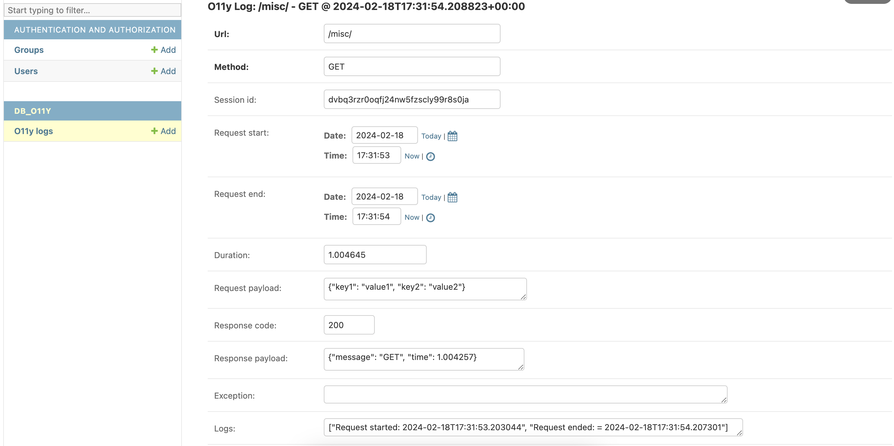

# Django DB O11y

(O11y is a [numeronym](https://en.wikipedia.org/wiki/Numeronym) for Observability).

## What is it? And why?

I have always wanted some kind of basic observability that can be committed to the database, explored using the Django admin, and which isn't hard to set up. Maintaining a proper observability stack is a full-time job in itself, but for smaller applications which are not performance-critical, surely there can be a simpler way.

Furthermore, it should track each request specifically, as tying together logs from different concurrent users can be very challenging. To me, the fundamental unit of observability is at the request-level, not the individual log-level.

`django_db_o11y` is my solution - a simple decorator to apply to your Django views that accepts logs being pushed to it, and it records the response code (and payloads, if configured). This can then be easily inspected via the Django DB admin.

## Usage

```python
from db_o11y.utils import auto_log

class MyViewSet(View):
    @auto_log()  # Simply decorate views with this one line
    def get(self, request, *args, **kwargs):

        # The decorator updates the request object with a method called 'add_log'.
        # This method updates a variable at the decorator-level via a closure.

        request.add_log('Request start')
        ...
        request.add_log('Something happened')
        ...
        request.add_log('Request end')
        return JsonResponse({'message': 'Hunky dory!'}, status=200)
```

## Result

### Django Admin



### Log detail



## Deployment

Currently, for GitHub reasons, it's a full Django project. The intention is that users would copy only the `db_o11y` app into their project. From there, they should:
* Add `db_o11y` to their Django project's `settings.py` file.
* Run `python manage.py makemigrations` and `python manage.py migrate` to make the `O11yLog` model available in their project.
* Import the `auto_log` decorator into any relevant views using `from db_o11y.utils import auto_log`.

I considered stripping out the Django project stuff from this repo, but then the tests wouldn't work and ultimately, it's expected that users may want to extend / alter the functionality in some ways, so keeping the tests on-hand is going to be important.

## Testing

Run `python manage.py test` -> currently 30 tests.

It goes without saying that if you modify / edit the functionality, then the tests should be updated as well. They should be simple enough to follow.

## Future plans

* Ideally this could be some kind of cross-framework solution, maybe utilising SQL Alchemy which is commonly used in conjunction with Flask and FastAPI. It is currently tied to the Django ORM however.

* Observability is more than just logs and traces however. Maybe one day I will get around to implementing metrics and other observability features. But this currently meets 99% of my current requirements.

* Learn how to deploy on PyPi so there is no manual tinkering required to install this project into the app, and then it can be done just like any other django-related package.
